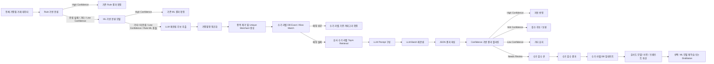
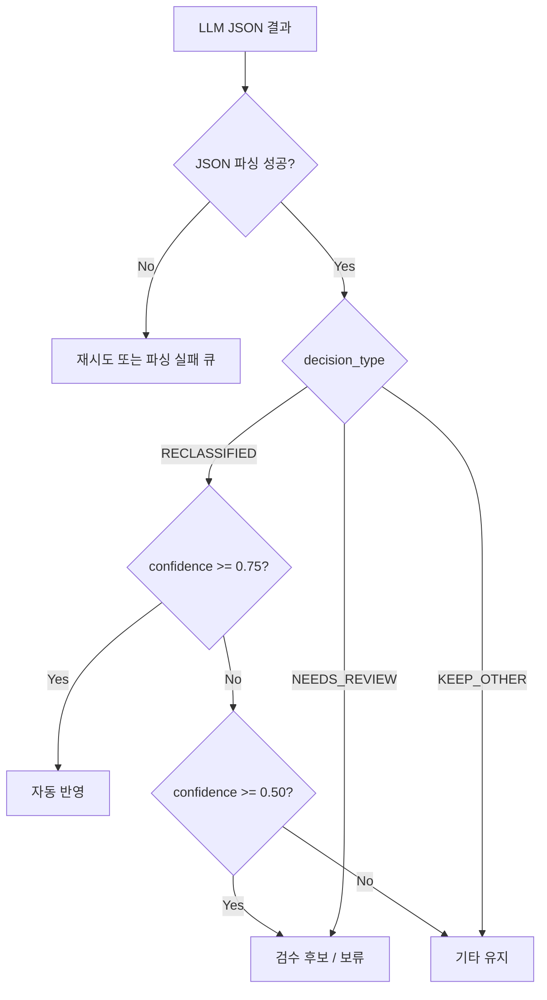
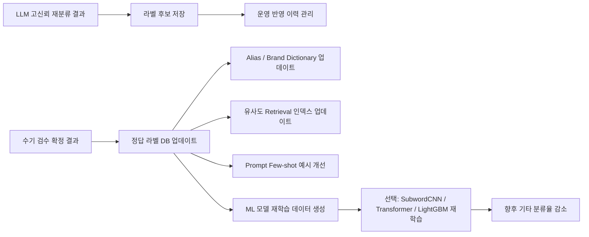

# LLM 기반 가맹점 재분류 아키텍처

> 목적: Rule 기반 분류와 ML 기반 분류 이후에도 `기타`, `미분류`, `UNKNOWN`, `Low-confidence`로 남은 가맹점명을 대상으로 LLM을 활용해 재분류한다.  
> 단, LLM을 전체 가맹점의 1차 분류기로 사용하는 것이 아니라, 기존 시스템이 처리하지 못한 후보군에 대해 **수기 라벨 DB + 유사 예시 검색 + LLM 재분류**를 적용하는 보완형 구조를 권장한다.

---

## 1. 전체 아키텍처 요약



---

## 2. 아키텍처의 핵심 방향

기존 구조가 `Rule 기반 분류 + SubwordCNN + WordNet Ensemble`이라면, LLM은 다음 위치에 적용하는 것이 가장 적합하다.

```text
Rule / ML에서 명확히 분류된 가맹점 → 기존 결과 사용
Rule / ML에서 기타로 남은 가맹점 → LLM 재분류 후보
수기 라벨 DB와 일치하는 가맹점 → LLM 호출 없이 정답 라벨 적용
수기 라벨 DB와 유사한 가맹점 → 유사 예시를 LLM prompt에 제공
LLM 결과가 고신뢰인 경우 → 자동 반영
LLM 결과가 저신뢰인 경우 → 기타 유지 또는 수기 검수
```

즉, LLM은 전체 분류기의 대체재가 아니라 **기타 가맹점 재분류를 위한 2차 보완 모듈**로 설계하는 것이 좋다.

---

## 3. 단계별 처리 구조

## 3.1 1차 분류: 기존 Rule + ML 시스템

### 목적

기존에 잘 동작하는 Rule 기반 분류와 ML 기반 분류는 유지한다.  
LLM은 모든 가맹점을 처리하지 않고, 기존 시스템이 처리하지 못한 샘플만 담당한다.

### 입력

```text
- 원본 가맹점명
- 기존 Rule 분류 결과
- 기존 ML 분류 결과
- ML confidence
- Rule/ML 충돌 여부
```

### 출력

```text
- 분류 성공 가맹점
- 기타 / 미분류 / UNKNOWN 가맹점
- Low-confidence 가맹점
- Rule-ML 충돌 가맹점
```

### 후보 추출 기준 예시

| 후보 유형 | 설명 |
|---|---|
| 기타 분류 | Rule/ML 이후 최종 카테고리가 기타인 경우 |
| 미분류 | 카테고리를 부여하지 못한 경우 |
| Low-confidence | ML confidence가 기준값 미만인 경우 |
| Rule-ML 충돌 | Rule 결과와 ML 결과가 서로 다른 경우 |
| 신규 가맹점 | 기존 사전이나 학습 데이터에 없는 가맹점 |

---

## 3.2 후보 추출 및 전처리

### 목적

LLM 호출 비용을 줄이고, 동일 가맹점에 대해 반복 호출하지 않기 위해 전처리와 중복 제거를 먼저 수행한다.

### 처리 내용

```text
1. 지점명 제거
   예: 스타벅스 강남역점 → 스타벅스

2. 지역명 제거
   예: 홍대, 강남, 잠실, 부산, 대구 등

3. 숫자/괄호/특수문자 제거
   예: BHC치킨(강남1호점) → BHC치킨

4. 대소문자 통일
   예: starbucks coffee → STARBUCKS COFFEE

5. 공백 및 기호 정리
   예: A.B.C MART → ABC MART

6. 한글/영어/로마자 표기 변형 고려
   예: KYOCHON → 교촌
   예: MOMSTOUCH → 맘스터치
```

### 중복 제거 예시

```text
원본:
- 스타벅스 강남역점
- 스타벅스 홍대점
- STARBUCKS COFFEE SEOUL
- 스타벅스코리아

정규화 후:
- 스타벅스
- STARBUCKS

최종 unique merchant:
- 스타벅스 / STARBUCKS 계열 1개 대표명으로 처리
```

---

## 3.3 수기 라벨 DB 우선 매칭

### 목적

수기 라벨링된 정답 가맹점 리스트가 있다면, LLM보다 먼저 활용해야 한다.  
수기 라벨은 사람이 검수한 정답에 가까운 anchor 역할을 하므로, exact match 또는 alias match가 가능하면 LLM 호출 없이 카테고리를 확정할 수 있다.

### 수기 라벨 DB 예시

| merchant_name | normalized_name | alias | category |
|---|---|---|---|
| 스타벅스 | 스타벅스 | STARBUCKS, STARBUCKS COFFEE | 카페/디저트 |
| 교촌치킨 | 교촌치킨 | KYOCHON, KYOCHON CHICKEN | 외식/음식점 |
| 올리브영 | 올리브영 | OLIVEYOUNG, OLIVE YOUNG | 뷰티/생활 |
| 다이소 | 다이소 | DAISO | 생활/잡화 |

### 매칭 우선순위

```text
1. Exact Match
   원본 가맹점명이 수기 라벨과 완전 일치

2. Normalized Exact Match
   정규화된 가맹점명이 수기 라벨의 normalized_name과 일치

3. Alias Match
   영어/로마자/약어/브랜드 별칭이 alias와 일치

4. Similar Match
   문자열 유사도 또는 embedding similarity가 높은 경우
```

---

## 3.4 유사 수기 라벨 Top-k Retrieval

### 목적

LLM prompt에 전체 수기 라벨 DB를 넣는 것은 비효율적이다.  
대신 현재 batch의 가맹점과 유사한 수기 라벨 예시만 검색해서 prompt에 넣는 RAG 방식을 사용한다.

### Retrieval 기준

| 방식 | 설명 |
|---|---|
| 문자열 유사도 | Levenshtein, Jaro-Winkler 등 |
| 토큰 유사도 | 공통 토큰, n-gram overlap |
| 초성/음역 유사도 | 한글 초성, 로마자-한글 변환 |
| Embedding similarity | 가맹점명 embedding 간 cosine similarity |
| 브랜드 사전 매칭 | 관리 중인 alias/brand dictionary 활용 |

### Retrieval 예시

```json
{
  "target_merchant": "KYOCHON CHICKEN GANGNAM",
  "retrieved_examples": [
    {"merchant_name": "교촌치킨", "category": "외식/음식점", "match_type": "ALIAS"},
    {"merchant_name": "KYOCHON", "category": "외식/음식점", "match_type": "NORMALIZED_EXACT"},
    {"merchant_name": "BHC치킨", "category": "외식/음식점", "match_type": "SIMILAR"},
    {"merchant_name": "BBQ치킨", "category": "외식/음식점", "match_type": "SIMILAR"}
  ]
}
```

---

## 3.5 LLM Batch 재분류

### 목적

LLM은 Rule/ML 이후 기타로 남은 가맹점 중, 수기 라벨 DB로 바로 해결되지 않은 가맹점을 재분류한다.

### 입력 구성

```text
- 카테고리 체계
- 재분류 대상 가맹점 목록
- 현재 batch와 관련된 수기 라벨 참고 예시
- 출력 JSON schema
- 분류 규칙
- 모호한 경우 기타/UNKNOWN 유지 규칙
```

### Batch 크기 추천

| 항목 | 추천값 |
|---|---|
| 초기 테스트 | 10~20개 |
| 안정화 후 | 20~50개 |
| 가맹점명이 짧고 taxonomy가 단순한 경우 | 50~100개 가능 |
| 수기 라벨 예시를 많이 넣는 경우 | 20~30개 권장 |

### LLM 설정값 추천

| 항목 | 추천값 |
|---|---|
| temperature | 0.0 ~ 0.1 |
| top_p | 0.1 ~ 0.3 |
| output format | JSON array |
| max retry | JSON parsing 실패 시 1~2회 |
| confidence 자동 반영 기준 | 0.75 이상 |
| 검수 후보 기준 | 0.50 이상 0.75 미만 |
| 기타 유지 기준 | 0.50 미만 |

---

## 4. LLM 재분류 프롬프트 템플릿

```text
당신은 금융 거래 데이터의 가맹점 카테고리 재분류 전문가입니다.

현재 입력되는 가맹점들은 이미 Rule 기반 분류와 ML 기반 분류를 거쳤지만,
최종적으로 "기타", "미분류", "UNKNOWN" 또는 낮은 신뢰도 상태로 남은 가맹점입니다.

당신의 목표는 가맹점명만 사용하여, 재분류가 가능한 가맹점은 제공된 카테고리 체계 중 하나로 분류하고,
근거가 부족한 가맹점은 기존처럼 "기타" 또는 "UNKNOWN"으로 유지하는 것입니다.

가맹점명은 한국어, 영어, 로마자 표기, 일본어, 중국어, 기타 외국어 또는 혼합 표기로 입력될 수 있습니다.
함께 제공되는 참고 예시는 사람이 직접 라벨링한 정답 가맹점에서 검색된 유사 사례입니다.

중요 규칙:
1. 반드시 제공된 카테고리 체계 안에서만 선택하세요.
2. 새로운 카테고리를 만들지 마세요.
3. 입력 정보는 가맹점명만 사용하세요.
4. 참고 예시는 사람이 직접 라벨링한 정답 데이터이므로, 현재 가맹점과 동일 브랜드 또는 명확한 표기 변형이면 강하게 참고하세요.
5. 참고 예시와 일부 단어만 유사한 경우에는 무리하게 적용하지 마세요.
6. 한글, 영어, 로마자 표기, 일본어, 중국어, 기타 외국어, 혼합 표기를 모두 고려하세요.
7. 외국어 또는 로마자 표기는 가능한 경우 한국어 브랜드명 또는 의미로 해석하세요.
8. 지점명, 지역명, 숫자, 괄호, 특수문자, 결제 단말기명, 불필요한 접미어는 내부적으로 제거하고 판단하세요.
9. 잘 알려진 브랜드이거나 상호명에 업종 단서가 명확한 경우에만 높은 confidence를 부여하세요.
10. 상호명이 일반적이거나 업종 단서가 부족하면 "기타" 또는 "UNKNOWN"으로 유지하세요.
11. 기존 Rule/ML이 분류하지 못한 샘플이라는 점을 고려하여, 모든 가맹점을 억지로 재분류하지 마세요.
12. 최종 출력은 JSON array 형식으로만 작성하세요.
13. JSON 외의 설명 문장은 출력하지 마세요.

내부 판단 구조:
1. 언어/표기 감지
2. 가맹점명 정규화
3. 외국어/로마자/브랜드명 해석
4. 수기 라벨 참고 예시와의 동일성 또는 유사성 확인
5. 업종 단서 추출
6. 카테고리 후보 매핑
7. 모호성 검토
8. 최종 카테고리 검증

판단 기준:
- 동일 브랜드 또는 명확한 표기 변형이면 reference match를 적극 활용하세요.
- 업종 단서가 명확하면 재분류하세요.
- 브랜드 지식이 확실하면 재분류하세요.
- 단어가 일반적이거나 업종이 불명확하면 기타 또는 UNKNOWN으로 유지하세요.
- confidence가 0.75 이상이면 자동 반영 가능한 수준입니다.
- confidence가 0.50 이상 0.75 미만이면 검수 또는 보류가 필요한 수준입니다.
- confidence가 0.50 미만이면 기타 유지가 적절합니다.

카테고리 체계:
{CATEGORY_TAXONOMY}

수기 라벨 참고 예시:
{RETRIEVED_LABELED_EXAMPLES}

재분류 대상 가맹점 목록:
{MERCHANT_LIST}

출력 형식:
[
  {
    "merchant_id": "입력 merchant_id",
    "original_name": "원본 가맹점명",
    "detected_language_or_script": "Korean | English | Romanized Korean | Japanese | Chinese | Mixed | Other | Unknown",
    "normalized_name": "정규화된 가맹점명",
    "interpreted_name": "해석된 브랜드명 또는 의미. 불확실하면 빈 문자열",
    "predicted_category": "카테고리 체계 중 하나 또는 기타 또는 UNKNOWN",
    "confidence": 0.0,
    "decision_type": "RECLASSIFIED | KEEP_OTHER | NEEDS_REVIEW",
    "reference_match": {
      "used_reference": true,
      "match_type": "EXACT | NORMALIZED_EXACT | ALIAS | SIMILAR | NONE",
      "reference_merchant_name": "참고한 수기 라벨 가맹점명. 없으면 빈 문자열",
      "reference_category": "참고한 수기 라벨 카테고리. 없으면 빈 문자열"
    },
    "reason": "최종 판단 근거를 한국어로 한 문장으로 작성",
    "is_ambiguous": true,
    "alternative_categories": [
      "대안 카테고리 1",
      "대안 카테고리 2"
    ]
  }
]
```

---

## 5. 결과 후처리 로직

LLM 결과는 그대로 운영 DB에 반영하기보다 confidence와 decision_type 기준으로 필터링한다.



### 후처리 기준

| 조건 | 처리 |
|---|---|
| `decision_type = RECLASSIFIED` and `confidence >= 0.75` | 자동 반영 |
| `decision_type = RECLASSIFIED` and `0.50 <= confidence < 0.75` | 검수 후보 또는 보류 |
| `confidence < 0.50` | 기타 유지 |
| `decision_type = KEEP_OTHER` | 기타 유지 |
| `decision_type = NEEDS_REVIEW` | 수기 검수 큐 적재 |
| JSON parsing 실패 | 재시도 또는 실패 큐 적재 |

---

## 6. 피드백 루프

LLM 재분류 결과와 수기 검수 결과는 다시 데이터 자산으로 축적해야 한다.



### 누적해야 할 데이터

| 데이터 | 활용 목적 |
|---|---|
| 원본 가맹점명 | 재분류 대상 추적 |
| 정규화 가맹점명 | 중복 제거 및 매칭 |
| LLM 예측 카테고리 | 자동 재분류 후보 |
| LLM confidence | 자동 반영 여부 판단 |
| decision_type | 운영 액션 결정 |
| 수기 검수 결과 | 정답 라벨 DB 업데이트 |
| 사용된 reference example | RAG 품질 분석 |
| 오분류 케이스 | 프롬프트/사전/모델 개선 |

---

## 7. 대량 처리 시 비용 절감 전략

대량의 기타 가맹점을 LLM이 처리해야 하는 경우, LLM 호출 전 후보 수를 최대한 줄이는 것이 중요하다.

```text
기타 가맹점 1,000,000건
→ 가맹점명 정규화
→ unique merchant 기준 100,000개로 축소
→ 수기 라벨 exact/alias match로 30,000개 해결
→ 모호하거나 빈도 낮은 샘플 필터링
→ LLM 대상 50,000개
→ batch 단위 재분류
→ high-confidence 결과만 자동 반영
→ mid/low-confidence 결과는 검수 또는 기타 유지
```

### 비용 최적화 포인트

| 전략 | 설명 |
|---|---|
| Unique merchant 기준 처리 | 거래 건 단위가 아니라 가맹점명 단위로 처리 |
| Exact/Alias match 선처리 | LLM 호출 전 수기 라벨 DB로 해결 |
| Batch 처리 | 여러 가맹점을 한 번에 LLM에 입력 |
| Top-k reference 제한 | batch와 유사한 수기 라벨 예시만 제공 |
| Low-confidence만 self-consistency | 모든 샘플에 반복 호출하지 않음 |
| 결과 캐싱 | 동일 normalized_name은 재호출하지 않음 |

---

## 8. 추천 운영 구조

최종적으로는 아래 우선순위로 운영하는 것이 좋다.

```text
1순위: 기존 Rule / ML에서 high-confidence 분류된 결과 유지
2순위: 수기 라벨 DB exact / alias match 결과 적용
3순위: 유사 수기 라벨 retrieval + LLM 재분류 적용
4순위: LLM high-confidence 결과만 자동 반영
5순위: mid-confidence 또는 ambiguous 샘플은 수기 검수
6순위: low-confidence 샘플은 기타 유지
7순위: 수기 검수 결과를 라벨 DB와 ML 재학습 데이터로 누적
```

---

## 9. 기대 효과

| 항목 | 기대 효과 |
|---|---|
| 기타 비율 감소 | 기존 Rule/ML이 처리하지 못한 가맹점 재분류 가능 |
| 다국어 대응 | 영어, 로마자, 외국어, 혼합 표기 가맹점 해석 가능 |
| 수기 라벨 활용 | 정답 DB를 anchor로 사용해 LLM 오분류 감소 |
| 비용 통제 | 전체가 아닌 기타 후보만 LLM 처리 |
| 운영 안정성 | confidence 기반 자동 반영/검수/기타 유지 분기 가능 |
| 지속 개선 | 수기 검수 결과가 다시 사전/라벨 DB/ML 모델 개선으로 연결 |

---

## 10. 핵심 결론

이 아키텍처의 핵심은 LLM을 전체 가맹점 분류기로 쓰는 것이 아니라, **기존 Rule + ML 시스템 이후에도 기타로 남은 가맹점을 재분류하는 보완 모델**로 쓰는 것이다.

특히 수기 라벨링된 정답 가맹점 리스트가 있다면, LLM prompt에 전체를 넣기보다 다음 방식이 가장 적합하다.

```text
수기 라벨 DB exact/alias match 우선 적용
→ 해결되지 않은 가맹점만 유사 수기 라벨 top-k 검색
→ 검색된 예시를 LLM prompt에 넣어 재분류
→ high-confidence 결과만 자동 반영
→ low-confidence 결과는 기타 유지 또는 수기 검수
→ 검수 결과를 다시 수기 라벨 DB와 ML 재학습 데이터로 누적
```

따라서 추천 아키텍처는 다음과 같이 요약할 수 있다.

```text
Rule + ML 기존 시스템
+ 수기 라벨 DB 기반 Exact/Alias Match
+ Similar Labeled Example Retrieval
+ SELF-DISCOVER-lite LLM Batch Reclassification
+ Confidence-based Post-processing
+ Human Review & Feedback Loop
```
